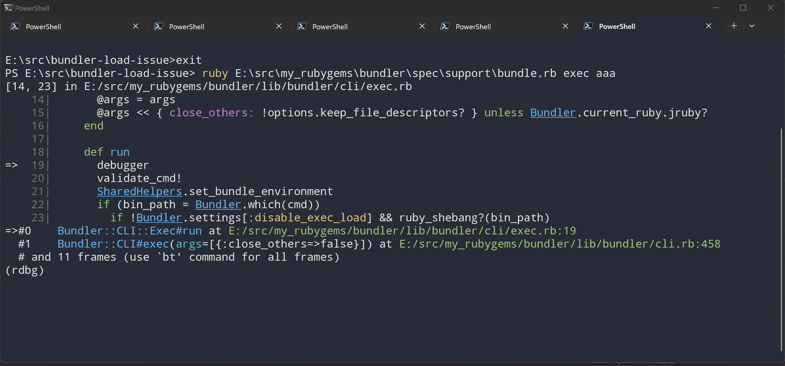

# Bundler Development setup

To work on Bundler, you'll probably want to do a couple of things:

* [Fork the Rubygems repo](https://github.com/rubygems/rubygems), and clone the fork onto your machine. ([Follow this tutorial](https://help.github.com/articles/fork-a-repo/) for instructions on forking a repo.)

* Install `graphviz` package using your package manager:

        sudo apt-get install graphviz -y

    And for OS X (with brew installed):

        brew install graphviz

* Install development dependencies and Bundler's test dependencies from the rubygems root directory:

        bin/rake setup spec:parallel_deps

* Change into the bundler directory:

        cd bundler

* Now you can run the test suite in parallel:

        bin/parallel_rspec

* Set up a shell alias to run Bundler from your clone, e.g. a Bash alias ([follow these instructions](https://www.moncefbelyamani.com/create-aliases-in-bash-profile-to-assign-shortcuts-for-common-terminal-commands/) for adding aliases to your `~/.bashrc` profile):

        alias dbundle='ruby /path/to/bundler/repo/spec/support/bundle.rb'

On Windows, you can add this to your [PowerShell profile][profile] (you can use `vim $profile` on the command line if you have `vim` installed):

```powershell
$Env:RUBYOPT="-rdebug"
function dbundle
{
	& "ruby.exe" E:\[source path]\rubygems\bundler\spec\support\bundle.rb $args
}
```

It is also recommended to use [Windows Terminal][terminal] for a better command line experience:



[profile]: https://learn.microsoft.com/en-us/powershell/module/microsoft.powershell.core/about/about_profiles?view=powershell-7.4
[terminal]: https://github.com/microsoft/terminal

## Jointly developing on Bundler and RubyGems

When developing Bundler features or bug fixes that require changes in RubyGems,
you can make sure Bundler's test suite picks up those changes by setting the
`RGV` environment variable to point to the root of the repository, like this:

```
RGV=.. bin/parallel_rspec
```

It's a good idea to make sure that your changes always work against the latest
RubyGems, so setting this variable permanently might be a good idea. You can use
[direnv](https://direnv.net) for that.

The `RGV` environment variable can also be set to arbitrary RubyGems versions,
to make sure your changes in Bundler work fine with those versions. For example,

```
RGV=v3.2.33 bin/parallel_rspec
```

## Debugging

See [DEBUGGING.md](DEBUGGING.md).

